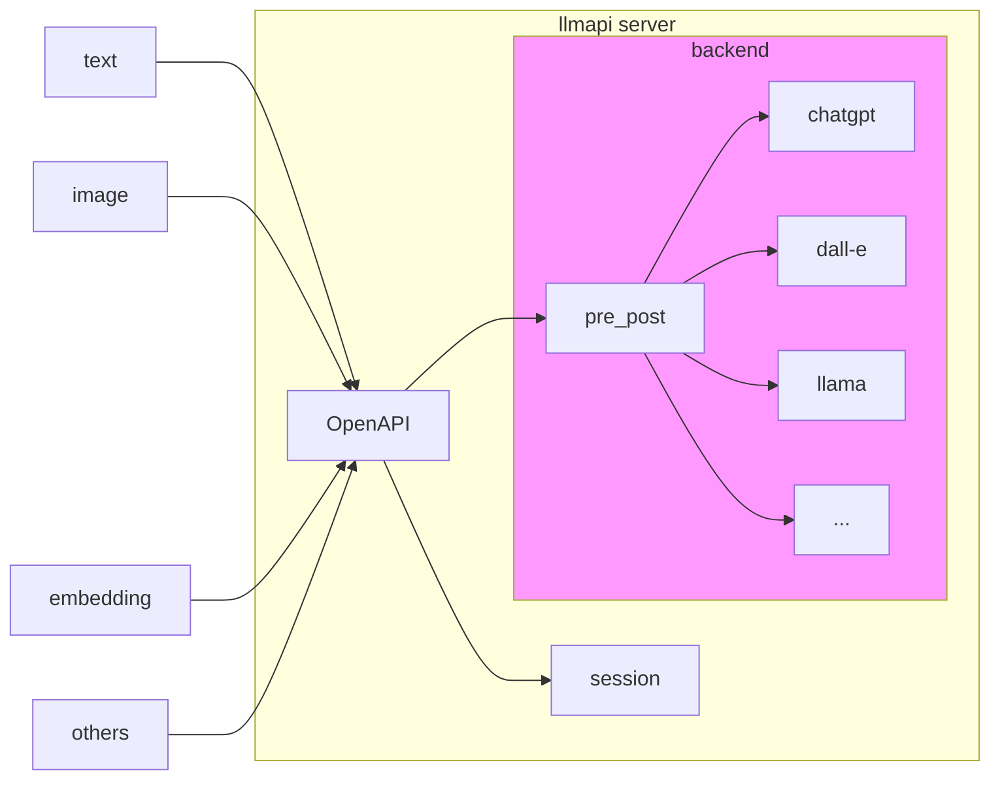

<p align="center">
  
  <h1 align="center">LLMApi Server</h1>
  <p align="center">Self-host llmapi server</p>
</p>

## Introdution

[中文文档](README.zh.md)

llmapi-server is an abstract backend that encapsulates a variety of large language models (LLM, such as ChatGPT, GPT-3, GPT-4, etc.), and provides simple access services through OpenAPI

## Diagram



## Supportted backend
1. `chatgpt`: openai's official ChatGPT interface
2. `gpt3`: openai's official GPT-3 interface
3. `gpt-embedding`: openai's official Embedding interface
4. `dall-e`: openai's official DALL·E interface
5. `welm`: wechat's llm interface
6. `newbing`: New Bing search based on ChatGPT（unofficial)

## Install & Run

1. run locally
``` shell
# python >= 3.8
python3 -m pip install -r requirements.txt

python3 run_api_server.py
```

2. run with docker

``` shell
./build_docker.sh
./start_docker.sh
```

## Visit server

1. Use the `curl` command to access:

``` shell
# 1. Start a new session
curl -X POST -H "Content-Type: application/json" -d '{"bot_type":"mock"}' http://127.0.0.1:5050/v1/chat/start
# response sample: {"code":0,"msg":"Success","session":"123456"}

# 2. chat with LLMs
curl -X POST -H "Content-Type: application/json" -d '{"session":"123456","content":"hello"}' http://127.0.0.1:5050/v1/chat/ask
# response sample: {"code":0,"msg":"Success","reply":"Text mock reply for your prompt:hello","timestamp":1678865301.0842562}

# 3. Close the session and end chat
curl -X POST -H "Content-Type: application/json" -d '{"session":"123456"}' http://127.0.0.1:5050/v1/chat/end
# response: {"code":0,"msg":"Success"}
```

2. Using command line tools:[llmapi_cli](https://github.com/llmapi-io/llmapi-cli)

``` shell
llmapi_cli --host="http://127.0.0.1:5050" --bot=mock
```

3. Integrate in your python code with llmapi_cli module
``` python
from llmapi_cli import LLMClient

client = LLMClient(host = "http://127.0.0.1:5050", bot = "mock")

rep = client.ask("hello")

print(rep)
```

## Plug into your LLM's backend !

1. You need to create a new backend name in the backend directory (assumed to be `newllm`), you can directly `cp -r mock newllm`
2. Referring to the implementation of `mock`, change the backend name to `newllm`
3. In the `newllm` directory, add the necessary dependencies, and all related development is bound to this directory
4. Add support for `newllm` in `backend.py`
