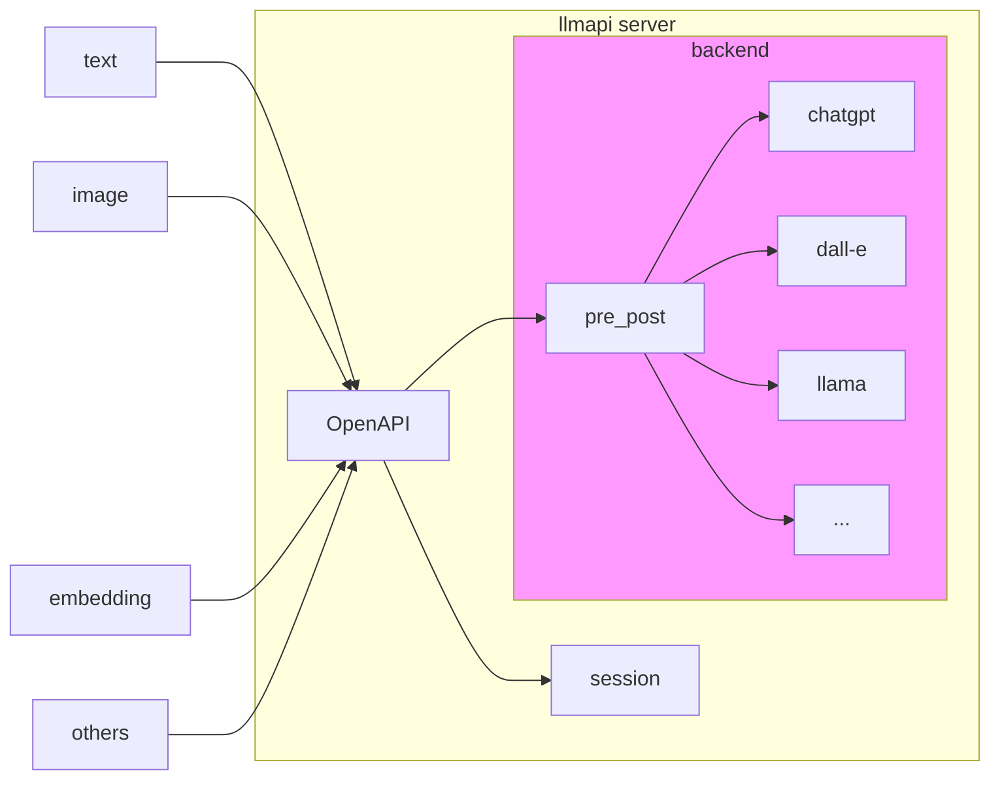

<p align="center">
  
  <h1 align="center">LLMApi Server</h1>
  <p align="center">可自托管的LLMApi服务端</p>
</p>


## 介绍
llmapi-server 是一个封装了多种大语言模型(LLM，如ChatGPT,GPT-3,GPT-4等)的抽象后端，并通过OpenAPI提供简单的访问服务

## 框图



## 已支持的后端
1. `chatgpt`: openai官方ChatGPT接口
2. `gpt3`: openai官方GPT-3接口
3. `gpt-embedding`: openai官方embedding接口
4. `dall-e`: openai官方DALL·E接口
5. `welm`: 微信团队大模型接口
6. `newbing`: 基于ChatGPT的新Bing搜索接口（非官方)

## 安装和运行

1. 本地安装运行
``` shell
# python >= 3.8
python3 -m pip install -r requirements.txt

python3 run_api_server.py
```

2. 使用docker运行

``` shell
./build_docker.sh
./start_docker.sh
```

## 访问server

1. 使用curl命令访问:

``` shell
# 1. 开始一个session
curl -X POST -H "Content-Type: application/json" -d '{"bot_type":"mock"}' http://127.0.0.1:5050/v1/chat/start
# response sample: {"code":0,"msg":"Success","session":"123456"}

# 2. 和后端进行对话交互
curl -X POST -H "Content-Type: application/json" -d '{"session":"123456","content":"hello"}' http://127.0.0.1:5050/v1/chat/ask
# response sample: {"code":0,"msg":"Success","reply":"Text mock reply for your prompt:hello","timestamp":1678865301.0842562}

# 3. 关闭session，结束对话
curl -X POST -H "Content-Type: application/json" -d '{"session":"123456"}' http://127.0.0.1:5050/v1/chat/end
# response: {"code":0,"msg":"Success"}
```

2. 使用[llmapi_cli](https://github.com/llmapi-io/llmapi-cli)命令工具访问

``` shell
llmapi_cli --host="http://127.0.0.1:5050" --bot=mock
```

3. 在你的python代码中使用llmapi_cli库访问
``` python
from llmapi_cli import LLMClient

client = LLMClient(host = "http://127.0.0.1:5050", bot = "mock")

rep = client.ask("hello")

print(rep)
```

## 接入你自己的LLM后端

1. 需要在backend目录内新建一个新的后端名称（假设为`newllm`）,可以直接`cp -r mock newllm`
2. 参照`mock`的实现，更改后端名称为`newllm`
3. 在`newllm`目录下，添加必要的依赖，所有相关的开发约束于该目录内
4. 在`backend.py`中添加对`newllm`的支持
